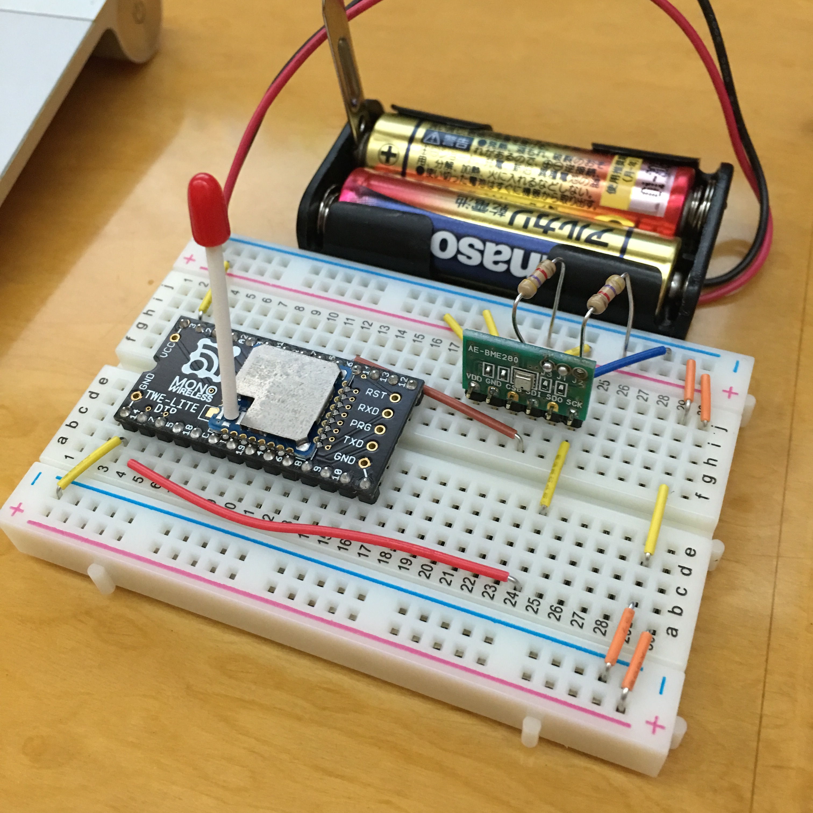

# ハードウェア編

## センサーの作成

センサーは、BME280 を TWELite DIP に接続します。

回路図は以下。


ブレッドボード上の配置は以下。




## TWELiteのファーム書き換え

モノワイヤレス(株)の公式ページに記載の通り、TWELiteには様々なファームが提供されています。
[TWE-APPS アプリ各種](http://mono-wireless.com/jp/products/TWE-APPS/index.html)

製品にはデフォルトで「超簡単！TWEアプリ」がインストールされて出荷され
ています。
今回は
「
[無線タグアプリ](http://mono-wireless.com/jp/products/TWE-APPS/Samp_monitor/index.html)
」を利用するため、ファームを書き換える必要があります。

### ファーム書き込み環境準備

ファームの書き込みは、Windows環境が必要。
(Linuxでの書き込み方法もあったはずなので、要調査)


#### ファーム書き込みソフト(Windows)を公式からダウンロードして来てインストールする

[TWE-LITE用プログラマ公式ページ](http://mono-wireless.com/jp/tech/misc/LiteProg/index.html)
から TWE-LITE プログラマ 0.3.4.3 をダウンロードしてインストールする。

#### ファーム書き込みソフト(Linux, OSX, Windows)を公式からダウンロードして来てインストールする

[jenprog フラッシュプログラマ](http://mono-wireless.com/jp/tech/misc/jenprog/index.html)

Python Script製なので、これで書き込めそう。

#### ファームを公式からダウンロードしてきて、展開する

[無線タグアプリ （Samp_Monitor）ダウンロード](http://mono-wireless.com/jp/products/TWE-APPS/Samp_monitor/download.html)
から、ファームウェア v1.5.5 βをダウンロードして、展開する。

ソースコードも含まれているが、実際に機器へ書き込むファイルは、子機・親機それぞれzip中の以下のファイルを利用する。

子機(TWELite)
Samp_Monitor/EndDevice_Input/Build/Samp_Monitor_EndDevice_Input_JN5164_1_5_5.bin

親機(MonoStick)
Samp_Monitor/Parent/Build/Samp_Monitor_Parent_JN5164_1_5_5.bin

or

Samp_Monitor/Parent/Build/Samp_Monitor_Parent_JN5164_ToCoStick_1_5_5.bin

### TWELite PCBの書き換え

1. TWELITE-RにTWELiteをセットする。
2. Win機とTWELITE-RをUSBケーブルで接続する。
3. 書き込みソフトを使って書き込む。


### MonoStickの書き換え

1. Win機のUSBスロットにMonoStickを差し込む
2. MonoStickをWin機にUSB接続する。
3. 書き込みソフトを使って書き込む。

## 子機・親機ともにシリアル接続して設定する

### 子機の設定

1. TWELITE-RにTWELiteをセットする。
2. Win機とTWELITE-RをUSBケーブルで接続する。
3. M2 ピンを GND に落とし、TWELITE-Rのリセットスイッチを押す。
4. teratermでシリアル接続する。
5. リターンキーを押すと設定画面が表示される。
6. 各項目を入力し、最後に'S'で設定書き込み。


### 親機の設定

1. Win機のUSBスロットにMonoStickを差し込む
2. teratermでシリアル接続する。
3. +++ を入力すると設定画面が表示される。
4. 各項目を入力し、最後に'S'で設定書き込み。


## 設定内容について

子機(TWELite)・親機(MonoStick)ともにシリアル経由で設定を変更する。
設定画面は以下のような雰囲気の表示となる。

```
--- CONFIG/Samp_Monitor V1-05-5/SID=0x810e00a7/LID=0x01/RC=9125 ---
 a: set Application ID (0x67726305)*
 i: set Device ID (1=0x01)*
 c: set Channels (15)
 x: set Tx Power (13)
 d: set Sleep Dur (5000)
 w: set Sensor Wait Dur (30)
 m: set Sensor Mode (0x39)*
 p: set Sensor Parameter (0)
 P: set Sensor Parameter2 ( )
 k: set Enc Key (0xA5A5A5A5)
 o: set Option Bits (0x00000001)
---
 S: save Configuration
 R: reset to Defaults
```

`a` は子機・親機で同じIDを設定する必要がある。また受講生毎に別々のID
にする必要がある。

`i` は子機は`1〜n`、親機は`0` に設定する。

`m` はBME280の場合は `39` (16進数) に設定する。

`d` は子機の発呼頻度(ミリ秒)だが、テストの際にはウェイトを`3000`(3秒)ぐらいにして確認するのが良い。

設定項目を入力しただけでは、設定変更はされない。必ず `S`(大文字のS)を
入力して書き込むこと。

インタラクティブモードの設定項目については、
[公式ページ](http://mono-wireless.com/jp/products/TWE-APPS/Samp_monitor/interactive.html)
にその他の項目についても詳細が記載されている。


## 試走

子機をブレッドボードに配置して、MonoStickをUSBに挿してシリアルを監視す
ると正しくできていれば、以下のようなシリアル表示がされるはず。

tsの行は空なので無視。rcの行の
`id`が上記で設定した子機のid、`ba`がバッテリー残量(100で割るとmV)、`tm`が気温(100で割ると℃)、`hu`が湿度(100で割ると%)、`at`が気圧(ヘクトパスカル)となる。

```
::rc=80000000:lq=150:ct=0005:ed=810E00A7:id=1:ba=3280:a1=2161:a2=1051:tm=2805:hu=6475:at=1009
::ts=1276
::ts=1277
::ts=1278
::ts=1279
::ts=1280
::rc=80000000:lq=147:ct=0006:ed=810E00A7:id=1:ba=3280:a1=2182:a2=1097:tm=2803:hu=6458:at=1009
::ts=1281
::ts=1282
::ts=1283
::ts=1284
::ts=1285
::rc=80000000:lq=147:ct=0007:ed=810E00A7:id=1:ba=3280:a1=2202:a2=1148:tm=2799:hu=6462:at=1009
::ts=1286
::ts=1287
```
